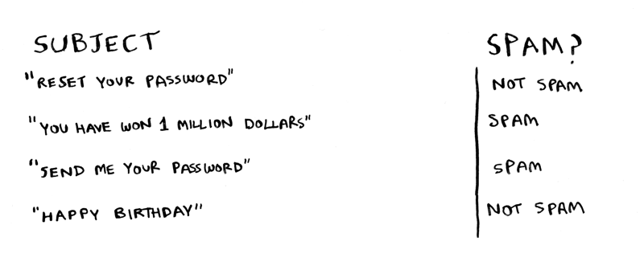

-   [\> adit.io](/index.html)
-   [Buy my book! Grokking Algorithms](http://amzn.to/29rVyHf)

::: {#container .container}
::: row
::: {#content .span12}
# Errata

This is the errata page for [Grokking
Algorithms](http://amzn.to/29rVyHf). If you see an error, please send me
an [email](mailto:adit@adit.io).

### Chapter 1

The full code for binary search includes this line:

` mid = (low + high)`

It should actually be:

` mid = (low + high) // 2`

------------------------------------------------------------------------

Throughout this book, I will mention `null`. `null` in Python is
represented by `None`. So if you want to see if something is null,
please compare it to `None`.

------------------------------------------------------------------------

> For binary search, you have to check log n elements in the worst case.
> For a list of 8 elements, log 8 == 3, because 2\^3 == 8. So for a list
> of 8 numbers, you would have to check 3 numbers at most.

For 8 numbers we actually need to check 4 numbers in the worst case.

------------------------------------------------------------------------

In the rocket example, I say:

> Bob runs binary search with 1 billion elements, and it takes 30 ms
> (log\~2\~ 1,000,000,000 is roughly 30 because 2\^30 = \~1 billion).
> \"32 ms!\"

I use 30ms first, and 32ms the second time. It should be 30ms both
times.

------------------------------------------------------------------------

The running times for `O(n!)` are wrong:

-   `8.6 x 10^505` should be `2.7 x 10^498`
-   `5.4 x 10^2638` should be `1.72 x 10^2631`.

### Chapter 2

Page 35: \"Quicksort is a faster sorting algorithm that only takes O(n
log n) time. It\'s coming up in the next chapter.\" The discussion of
quicksort actually occurs in chapter 4 and not the next chapter, chapter
3.

### Chapter 3

On Page 41, this snippet:

``` {.highlight .haskell}
def countdown(i):
print i
countdown(i-1)
```

Should be formatted as:

``` {.highlight .haskell}
def countdown(i):
  print i
  countdown(i-1)
```

------------------------------------------------------------------------

On Page 41, in the countdown function the base case is `if i <= 0`, but
in the illustration below I say `if i <= 1`. It should be `if i <= 1` in
both cases.

On Page 43, the code for the `bye()` function should be indented the
same as `greet2()`.

### Chapter 4

On Page 56, I show how the farm can be divided up into 80x80 plots. But
the grid I\'ve shown is a 14x8 grid. It should be 21x8.

------------------------------------------------------------------------

I talk about partitioning an array in quicksort, with an array of five
elements: \"Here are all the ways you can partition this array,
depending on what pivot you choose.\" Right after that line, I have a
big image showing the various ways the array can be partitioned. The
first partition should be: `[ ] <1> [ 3, 5, 2, 4 ]`.

------------------------------------------------------------------------

In this chapter at different times I mention:

-   it is better to choose a random element as the pivot
-   it is better to choose the middle element of the array as the pivot.

Obviously they can\'t both be correct. The O(n lg n) avg case runtime of
quicksort only applies if you choose a random element as the pivot. So
choose a random element as the pivot.

### Chapter 5

Page 82: The second line of check_voter() is `print "kick them ou` which
isn\'t complete. It should be `print "kick them out!"`

------------------------------------------------------------------------

On Page 94, I say \"once your load factor is greater than .07\". That
should be \"0.7\".

### Chapter 7

On page 120, I incorrectly say \"use Bellman-Ford\" instead of \"use
Dijkstra\'s algorithm\".

------------------------------------------------------------------------

On page 122, I say that Dijkstra\'s algorithm only works with DAGs. This
is incorrect, Dijkstra\'s algorithm works even if there is a cycle, as
long as it is a positive weight cycle.

------------------------------------------------------------------------

Page 130: In the last paragraph on the page, \"Dijkstra\'s algorithm
assumed that because you were processing the poster node, there was no
**faster** way to get to that node.\" For this example, it would have
been better to use the word \"cheaper\" instead of \"faster\".

------------------------------------------------------------------------

Dijkstra\'s algorithm, page 132.

The top half of the page sets up the weights such that start -\> A is 6
and start -\> B is 2. However, the section at the middle of the page
shows the weights being swapped:

``` {.highlight .haskell}
>>> print graph['start']['a']
2
>>> print graph['start']['b']
6
```

The values above should be swapped.

------------------------------------------------------------------------

In exercise 7.1(c) I say there\'s a negative weight cycle. However, even
though there is a negative weight edge, the -1 and outweighed by the 2s
in the rest of the cycle, so it ends up not being a negative weight
cycle. So an answer is possible.

### Chapter 8

> It takes O(2\^n) time, because there are 2\^n stations.

That should read \"2\^n subsets\", not stations.

------------------------------------------------------------------------

On page 149, the arrow for \"New syntax! This is called a set
intersection.\" should point to the first line, not the second line.

------------------------------------------------------------------------

In the code snippet on the bottom of page 151, the last two lines should
be indented so that they are *inside* the while loop:

``` {.highlight .haskell}
while states_needed:
  ....
  states_needed -= states_covered
  final_stations.add(best_station)
```

------------------------------------------------------------------------

On page 152 the exact algorithm takes O(2\^n) time, not O(n!) time.

------------------------------------------------------------------------

In this chapter, I spelled footballer [Brandon
Marshall](https://en.wikipedia.org/wiki/Brandon_Marshall)\'s name
incorrectly.

------------------------------------------------------------------------

In this chapter I mention that Breadth-First Search is a greedy
algorithm, but it is not.

------------------------------------------------------------------------

In this chapter, I describe a version of the traveling salesman problem
where verifying a solution is also NP-complexity. I call the traveling
salesman problem NP, but being in NP class implies that there is
polynomial time verification algorithm.

### Chapter 9

On page 173, the bottom left square of the grid should contain
\"\$2000\", not \"\$3500\".

------------------------------------------------------------------------

On page 182, the bottom left square in both grids should contain a
\"1\", not a \"0\", since H == H in both cases.

### Chapter 10

I mention in this chapter that Netflix used KNN for recommendations, but
a reader pointed out that they used collaborative filtering.

------------------------------------------------------------------------

Page 194: I say that Priyanka and Morpheus are 24 apart. They are
actually sqrt(24) apart.

------------------------------------------------------------------------

On page 200, I talk about a \"nigerian prince\" in the spam/not spam
example. That example is not very inclusive, this updated image removes
that example:



### Chapter 11

In this chapter, I talk about the SHA algorithms, and how they are used
for passwords. People have found that the SHA algorithms are [not secure
enough](https://blog.mozilla.org/security/2011/05/10/sha-512-w-per-user-salts-is-not-enough/).
The current industry recommendation is to use one of
bcrypt/scrypt/PBKDF2. Here\'s what a reader had to say:

> Password hashes are really an algorithm class of their own. A hash
> algorithm such as SHA-512 can be \"secure\" in terms of being
> relatively free of predictable collisions but still be inappropriate
> for a password hash if it is computationally efficient. Bcrypt is
> intentionally hard to calculate in terms of CPU cycles, and scrypt is
> difficult in terms of memory needed.

The Diffie-Hellman algorithm is not the same as asymmetric encryption.
Here\'s the comment I got from a reader:

> Asymmetric encryption is indeed interesting! The problem of key
> exchange is related to the problem of secure encryption but is not the
> same. This is similar to saying that problem of distributing real,
> metal keys to authorized users is related to the problem of designing
> a secure padlock but is not the same.
>
> Whit Diffie and Martin Hellman invented a way of allowing two parties
> to agree on a secret key without a man in the middle being able to
> obtain that secret. This is different than the problem of using that
> secret key to encrypt some plaintext. With Diffie Hellman key exchange
> the encryption key is a secret. Diffie Hellman key exchange isn\'t a
> cryptosystem at all.
>
> Whit Diffie and Martin Hellman also proposed the idea of asymmetric
> encryption, but did not provide an algorithm for implementing this
> idea. This is separate from Diffie Hellman key exchange.
>
> RSA encryption, on the other hand, is an asymmetric cryptosystem (the
> first such system widely known to the public, in fact). RSA is, today,
> perhaps not the best asymmetric cryptosystem (we are concerned about
> resistance to quantum cryptanalysis), but it is still in use and it\'s
> relatively easy to understand.
:::
:::

::: {.row style="padding-top: 50px;"}
[Privacy Policy](/privacy.html)
:::
:::
